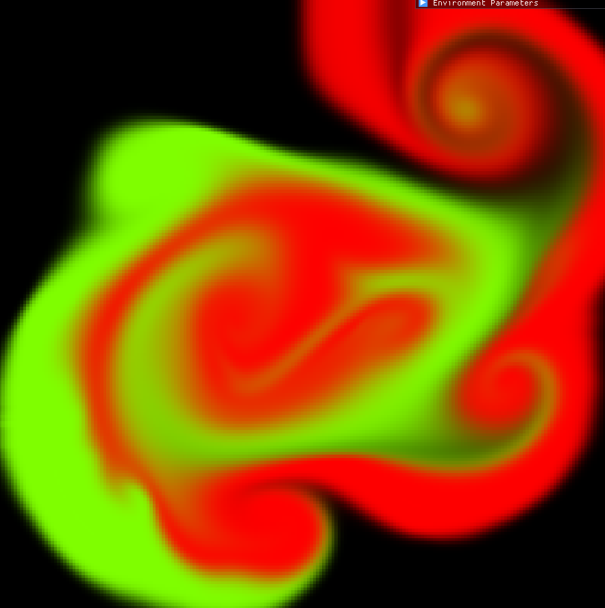
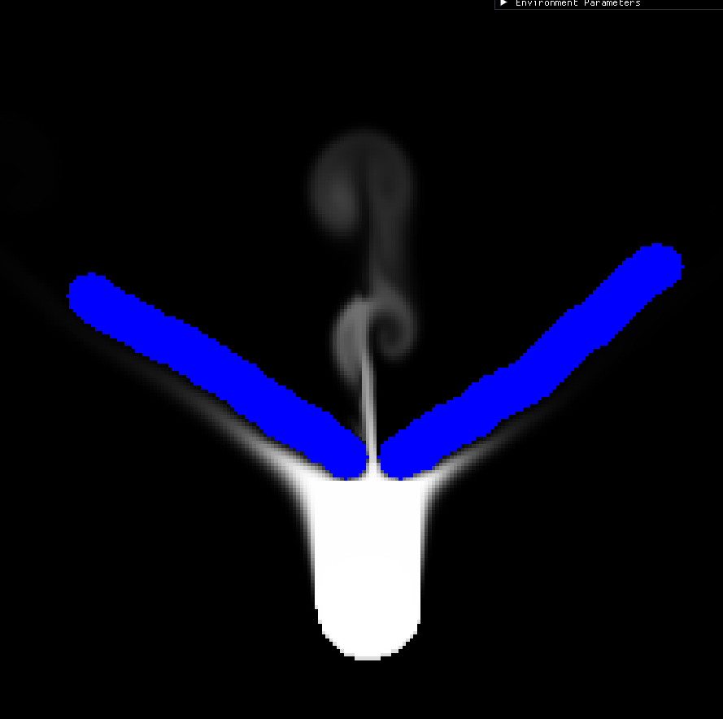
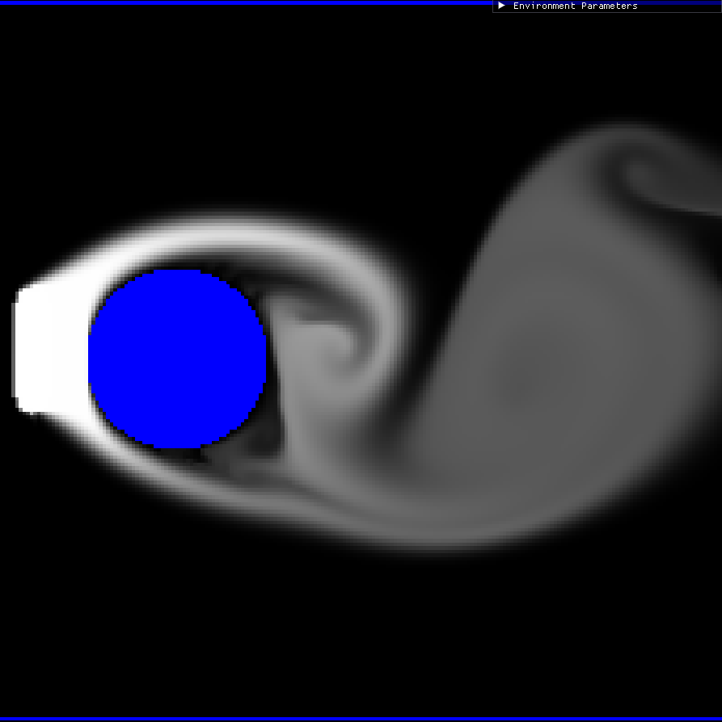

## About the Project
This project is an interactive, parallelized 2D Eulerian fluid solver. The solver is inspired by the article [stable fluids](https://pages.cs.wisc.edu/~chaol/data/cs777/stam-stable_fluids.pdf) and is composed of four main steps:
-advection
-diffusion
-external forces
-projection

The solver is written in CUDA and is highly parallelized to achieve real-time simulation at high resolution. Visualization is handled using the OpenGL library.

The solver is highly interactive. Users can define the initial state by drawing solid boundaries and smoke densities in different colors. Users can also apply forces to the fluid to influence its trajectory. The behavior of the fluid can be further controlled through various simulation parameters.






## Requirements
Windows 10/11 (64-bit) 

CUDA Toolkit ≥ 12.4

CMake ≥ 3.26

vcpkg 

Ninja

## Configuration
Install glfw3 and glad
```
.\vcpkg install glfw3:x64-windows
.\vcpkg install glad:x64-windows
```

Configure and build the project.
```
cmake -S . -B build -G -DCMAKE_TOOLCHAIN_FILE=<VCPKG_ROOT>/scripts/buildsystems/vcpkg.cmake -DVCPKG_TARGET_TRIPLET=x64-windows 
cmake --build build
```

This will generate a .exe file in the build directory.
